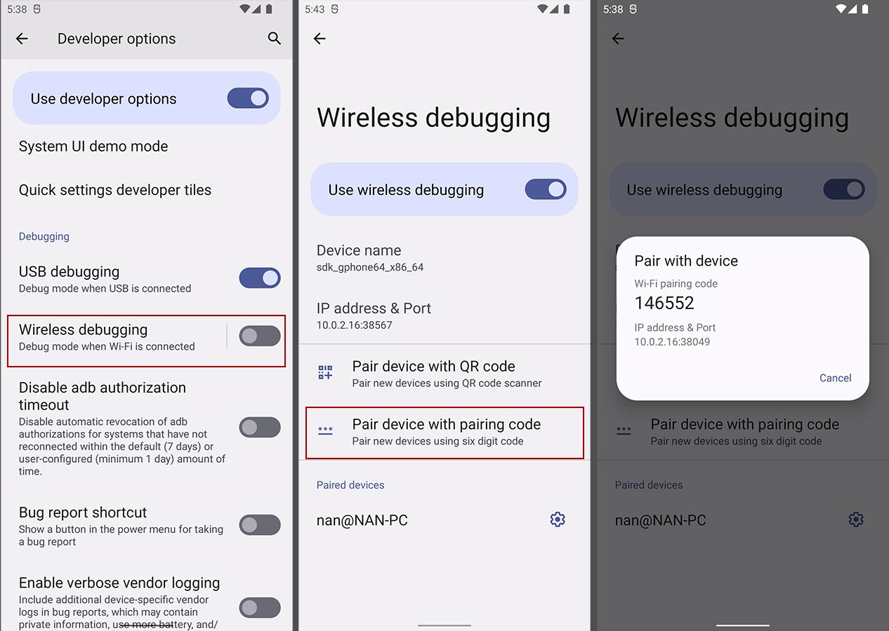

本文教你如何在Windows的子系统WSL2来运行Ubuntu 20.0.4 TLS作为Flutter的开发环境，使用真机或模拟器进行调试， 并支持热更新。

> 如何您已经安装好了环境，只是需要使用真机或模拟器进行调试，请直接查看 [模拟器调试](#模拟器调试最终解决方案)

<!--more-->

## 环境说明

- Windows 11 专业版
- WSL 2 (Ubuntu 20.04)
- Visual Studio Code (1.66.2)
- Flutter (2.10.5)

---

## 在WSL2中安装

### 安装 JDK

安装任意一个JDK即可， 推荐使用 [SDKMAN](https://sdkman.io/install)

```bash
curl -s "https://get.sdkman.io" | bash
source "$HOME/.sdkman/bin/sdkman-init.sh"
sdk install java 11.0.14.10.1-amzn
```

### 安装 Android SDK

只需要安装 [Command line tools only](https://developer.android.com/studio#command-tools)

```bash
sudo apt install -y git unzip zip
mkdir ~/downloads
wget https://dl.google.com/android/repository/commandlinetools-linux-8092744_latest.zip
cd ~/downloads
unzip commandlinetools-linux-8092744_latest.zip
mkdir -p  ~/.local/android/cmdline-tools/
mv cmdline-tools/ ~/.local/android/cmdline-tools/latest
rm commandlinetools-linux-6609375_latest.zip
```

添加环境变量到 `.bashrc` 中：

```
# WSL2 Host IP
export WSL_HOST_IP="$(tail -1 /etc/resolv.conf | cut -d' ' -f2)"

# Android
export ANDROID_HOME="$HOME/.local/android"
export PATH="$ANDROID_HOME/cmdline-tools/latest/bin:$ANDROID_HOME/platform-tools:$PATH"
```

安装其它依赖

```bash
source ~/.bashrc
sdkmanager --version
sdkmanager --list
sdkmanager --install "system-images;android-32;google_apis;x86_64" "platform-tools" "platforms;android-32" "build-tools;32.0.0"
sdkmanager --list | sed -e '/^$/q'
sdkmanager --licenses
```

同意所有的Licenses

### 安装 Flutter

查看 [Flutter官方网站](https://docs.flutter.dev/get-started/install/linux) 或使用 [fvm](https://fvm.app/docs/getting_started/installation) 进行版本管理


```bash
cd ~/downloads
wget https://github.com/fluttertools/fvm/releases/download/2.3.1/fvm-2.3.1-linux-x64.tar.gz
tar -zxvf fvm-2.3.1-linux-x64.tar.gz
mkdir -p ~/.local/bin
mv fvm/fvm ~/.local/bin
rm -rf fvm fvm-2.3.1-linux-x64.tar.gz
```

添加环境变量到 `.bashrc` 中：

```
# Flutter
export FVM_HOME="$HOME/.local/fvm"
export FLUTTER_ROOT="$FVM_HOME/default"
export PATH="$FLUTTER_ROOT/bin:$FLUTTER_ROOT/bin/cache/dart-sdk/bin:$HOME/.pub-cache/bin:$PATH"
export PUB_HOSTED_URL=https://pub.flutter-io.cn
export FLUTTER_STORAGE_BASE_URL=https://storage.flutter-io.cn
```

使用 fvm 安装 flutter


```bash
source ~/.bashrc
fvm install 2.10.5
flutter doctor
flutter doctor --android-licenses
```

> 如果你不需要模拟器调试，可以不用进行Windows上的操作，按下面操作进行就可以了

### 真机调试


点击 **无线调试**，开启无线调试， **使用配对码配对设备**。

使用 `adb pair [192.168.2.31]:[39831]` 进行一次配对，以后不需要再进行配对, 下次直接使用 `adb connect 192.168.2.31:42723` 连接就可以。

> 注意把ip和端口换成自己的。另外每次端口是会变的，如果希望有个固定的端口，可以使用 `adb tcpip 5555` 来设置一下端口，不过每次重启手机后会失效。
>
> ---
>
> 没有 **无线调试** 功能的，就需要在windows中也安装一下`adb`后，使用USB线连接一次后，设置 `adb tcpip 5555`，再断开连接线，也是可以进行 **无线调试** 的。

> 如果你希望使用模拟器进行调试，那么请继续看下面的步骤吧。

---

## 在Windows中安装

### 安装 Android SDK

安装 [Command line tools only](https://developer.android.com/studio#command-tools)

下载并解压到目录， 如 `C:\Android\cmdline-tools\latest`， 并配置环境变量

在环境变量的 `PATH` 中添加以下值

```
C:\Android\cmdline-tools\latest\bin
C:\Android\platform-tools
C:\Android\emulator
```

接下来的步骤和在WSL2中[安装 Android SDK]一样， 打开CMD，执行以下命令

```cmd
sdkmanager --version
sdkmanager --list
sdkmanager --install "system-images;android-32;google_apis;x86_64" "platform-tools" "platforms;android-32" "build-tools;32.0.0"
sdkmanager --list | sed -e '/^$/q'
sdkmanager --licenses
```

### 创建模拟器

还是在CMD中执行：

```cmd
avdmanager list
avdmanager create avd -n flutter_emulator -d pixel_5 -k "system-images;android-32;google_apis;x86_64"
avdmanager list avd
emulator -avd flutter_emulator
```

---

### 模拟器调试的困难

搜索了很多网上的方法，有用 `ADB_SERVER_SOCKET` 方式的。不过效果不行，运行 `flutter run` 不能更热新。

方法来源：
[How to make Flutter work on WSL2 using host's emulator?](https://stackoverflow.com/questions/62857688/how-to-make-flutter-work-on-wsl2-using-hosts-emulator)

```
# on windows 
adb kill-server
adb -a -P 5037 nodaemon server

# on wsl2
export WSL_HOST_IP="$(tail -1 /etc/resolv.conf | cut -d' ' -f2)"
export ADB_SERVER_SOCKET=tcp:$WSL_HOST_IP:5037
```

查看了github上的回答，可以使用以上方式+下面的命令解决不能热更新的问题。

[Developing Flutter with VSCode and WSL2 #42521](https://github.com/flutter/flutter/issues/42521#issuecomment-745282288)

[--host-vmservice-port no longer works in 1.25.X #74084](https://github.com/flutter/flutter/issues/74084#issuecomment-761266075)

```bash
# on wsl2
socat tcp-listen:43550,reuseaddr,bind=127.0.0.1,fork tcp:$(cat /etc/resolv.conf | tail -n1 | cut -d " " -f 2):43550
flutter run --verbose --host-vmservice-port=43550 --dds-port=43552
```

原理是使用 `--host-vmservice-port` 指定 `adb forward` 一个端口来给dart的vmservice提供访问，这就是热更新的关键地方。添加 `--dds-port` 是因为flutter新版本修改了一些行为。

[Support legacy behavior for --host-vmservice-port and --observatory-port with DDS #70336](https://github.com/flutter/flutter/pull/70336#issue-741176437)

不过使用过程中发现还是存在问题

- 有的时候结束了flutter进程后，windows因为`socat`的连接没关闭，指定的那个端口就被占用。再启动就会冲突。
- 另外在`vscode`中添加参数运行的时候，热更新也会失效。

以上方法还是提供了一个思路，下面是最终的解决方案：

### 模拟器调试最终解决方案



前面如果进行了 `ADB_SERVER_SOCKET` 配置的记得把环境变量去掉一下。另外可以运行一下 `adb forward --remove-all` 把之前的映射给关一下。



第一步是打开模拟器上的开发者模式


第二步和之前的真机调试是一样的, 打开真机调试



到这里这个 **IP地址** 是不能直接连接的，然后我们需要在windows用 `adb forward` 做一次端口映射。

```cmd
# on windows
adb forward --remove-all
# 配对的端口
adb forward tcp:15550 tcp:38049
# 连接的端口
adb forward tcp:15555 tcp:38567
```

成功映射后就可以在 ***WSL2*** 中进行配对连接了

```bash
# on wsl2
export WSL_HOST_IP="$(tail -1 /etc/resolv.conf | cut -d' ' -f2)"
adb pair $WSL_HOST_IP:15550
adb connect $WSL_HOST_IP:15555
adb devices
```

到这里就可以愉快的进行开发啦。